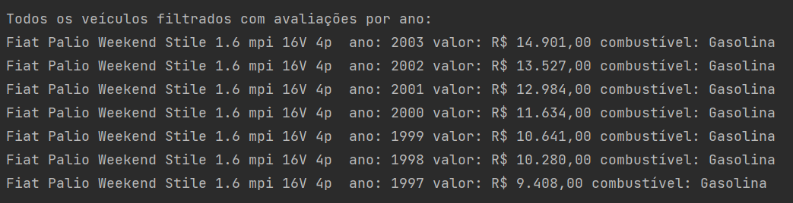
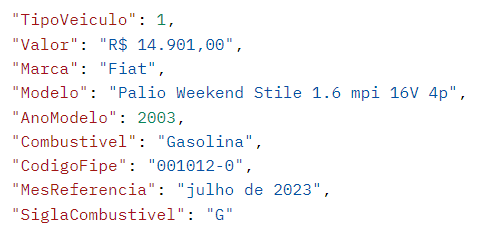

🔨 Objetivos do projeto
O objetivo do projeto é ter um fluxo similar ao que é feito no site, porém com algumas melhorias.
Criaremos um projeto Spring com linha de comando, utilizando a classe Scanner para fazer interações com o usuário via terminal.
Solicitaremos que o usuário digite o tipo de veículo desejado (carro, caminhão ou moto).
Feito isso, listaremos todas as marcas daquele tipo de veículo, solicitando que o usuário escolha uma marca pelo código.
Após essa escolha, listaremos todos os modelos de veículos daquela marca.
Solicitaremos que o usuário digite um trecho do modelo que ele quer visualizar, por exemplo PALIO.
Listaremos apenas os modelos que tiverem a palavra PALIO no nome.
Usuário escolherá um modelo específico pelo código e, diferente do site, já listaremos as avaliações para TODOS os anos disponíveis daquele modelo, retornando uma lista de forma similar à imagem abaixo:

Observações:
Para realização do desafio faremos o consumo de uma API, documentada nesse link.

De acordo com o escolhido (carro, moto, ou caminhão) vamos fazer uma chamada a um dos endpoints abaixo para buscar as marcas:

https://parallelum.com.br/fipe/api/v1/carros/marcas

https://parallelum.com.br/fipe/api/v1/motos/marcas

https://parallelum.com.br/fipe/api/v1/caminhoes/marcas

O retorno dessa requisição será uma lista com código e marca desejada. Caso o usuário queira por exemplo fazer uma consulta a modelos de carros da Fiat, que possui o código 21, terá que fazer uma nova requisição para o endpoint:
https://parallelum.com.br/fipe/api/v1/carros/marcas/21/modelos

Feito isso, irá escolher um código de modelo, por exemplo esse Palio Weekend Stile 1.6 mpi 16V 4p, representado pelo código 560. Então deverá fazer uma terceira requisição para o endpoint:
https://parallelum.com.br/fipe/api/v1/carros/marcas/21/modelos/560/anos

Para saber a avaliação para cada ano disponível, teremos que fazer requisições pelo código por ano, onde obteremos um retorno similar ao que é mostrado abaixo:
https://parallelum.com.br/fipe/api/v1/carros/marcas/21/modelos/560/anos/2003-1

Para podermos exibir em nossa aplicação as avaliações de todos os anos para esse modelo, será necessário trabalhar com as coleções e estruturas de repetição para poder exibir já todos as avaliações de todos os anos para o nosso usuário.
Utilize a biblioteca Jackson para a desserialização dos dados.
Modele as classes de acordo com o necessário para representar as marcas, modelos e dados dos veículos.
Relembre os conceitos vistos no curso para filtrar os modelos por um trecho do nome.
Bom desafio!